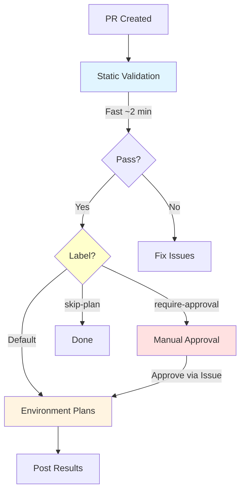

# Terraform Azure Starter Template

Template for Azure infrastructure using Terraform with using central CI/CD workflows.

Uses shared GitHub Actions workflow here: <https://github.com/kewalaka/github-azure-iac-templates>

## Quick Start

1. **Use this template** to create your repository
1. **Set up GitHub environments and Azure OIDC** ([guide](docs/setup.md))
1. **Create a PR** - validation runs automatically
1. **Approve** - dev deployment runs on main

## How It Works



PRs run flexibly based on labels:

1. **Static validation** (immediate): fmt, validate, TFLint, Checkov
2. **Conditional flow** (label-controlled):
   - **Default (no label)**: Plans run automatically after validation
   - **`require-approval` label**: Manual approval required before plans
   - **`skip-plan` label**: Skip plan stage entirely
3. **Environment plans** (parallel, unless skipped): Terraform plan for dev (add more via [guide](docs/adding-environments.md))

After merge, manually deploy via Actions workflow with approval on apply only (no approval needed for plan).

## Repository Structure

```text
iac/
  ├── main.tf                    # Infrastructure code
  ├── backend.tf                 # State configuration
  └── environments/
      └── dev.terraform.tfvars   # Environment config
.github/workflows/
  ├── terraform-pr.yml           # PR validation
  └── terraform-deploy.yml       # Deployment
```

## Key Features

- Matrix-based validation across environments
- Fast static checks without auth
- OIDC authentication (no stored credentials)
- Parallel environment plans
- **Flexible approval workflow** (label-controlled):
  - Auto-plan by default (fastest path)
  - Optional manual approval via `require-approval` label
  - Optional skip plan via `skip-plan` label
- Avoids double approvals during deployment
- Environment protection only on deployment apply stage
- Azure Developer CLI compatible

## Documentation

- [Setup Guide](docs/setup.md) - Configure GitHub environments and Azure OIDC
- [PR Approval Workflow](docs/approval-pr-workflow.md) - How PR approvals work and why
- [Adding Environments](docs/adding-environments.md) - Scale from dev to prod
- [Workflow Design](docs/workflow-design.md) - Architecture decisions and alternatives
- [Troubleshooting](docs/troubleshooting.md) - Common issues and solutions
- [Using azd locally](docs/using-azd.md) - Optional local workflow with Azure Developer CLI

## License

See [LICENSE.md](LICENSE.md)
