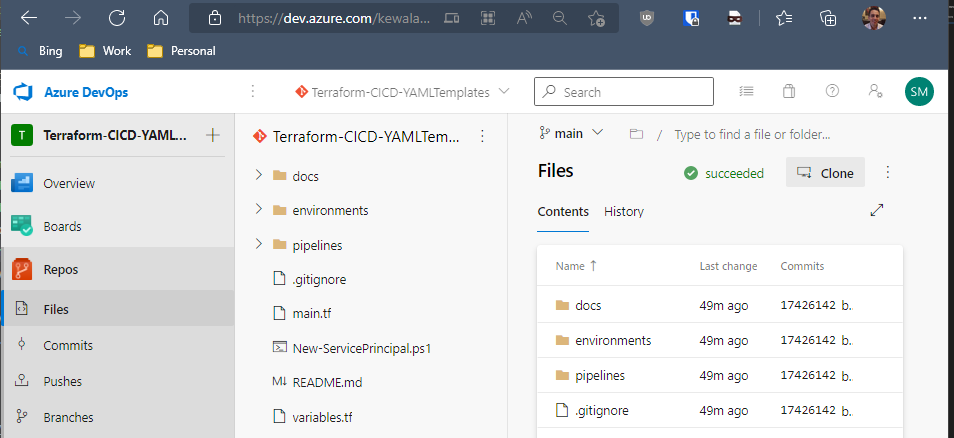

# Add a pipeline to an existing project
Stu's pipeline template project is available publicly from: https://dev.azure.com/kewalaka/Terraform-CICD-YAMLTemplates/

You can use "Clone" to make a copy of this on your machine.  Again, select a folder to store the project repository (e.g. c:\src\kewalaka\)

### Add the pipeline template project to your project

Copy the contents (excluding the "docs" and ".git" folder) to you new project
