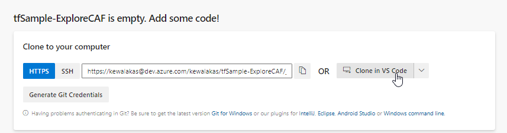

# Getting started with pipelines

## What we'll cover

In this section, we'll cover
* How to get Azure DevOps set up
* Create your first project
* Clone an existing template repository
* Commit your first check-in to your DevOps project.

You'll need:
*  an **Azure subscription**, a free tree will do.
* Either;
  * A Microsoft or GitHub account to create a new Azure DevOps organisation
  * Access to an existing DevOps organisation.

The following free software is required to follow along:
* **Visual Studio Code** (recommended)
* **Git for Windows** (or equivalent, if not using Windows)

## Create an Azure Devops Organisation

If you want to try things out in a lab, you can use Azure DevOps with any Microsoft account.

First, log in to https://dev.azure.com and select "Start Free", and log in.

The first time you log in you'll be asked to create a new project:


Subsequently you can create new projects from the organisation home page:


## Azure DevOps Projects

An project is the container that will include your code repository and pipelines.

### Create a location for your source code.

Choose a location where you'd like to store your code.  As an example you could use **C:\src** and then store projects by author or DevOps organisation and project name, for example:

```
c:\src\kewalaka\Terraform-CICD-YAMLTemplate
c:\src\<your orgname>\tfSample-CAFSample
```

### Get started with a new repository

In the new project, select "Repos", or choose it from the left hand menu


Choose "Clone to VSCode"



You'll be prompted to authenticate

Then the repository will start cloning:


Select to "open" in an new workspace:


## Add some code

Select the source control button:

Enter a description of what is being check-in, e.g. "initial commit", and press Ctrl+[Enter]

